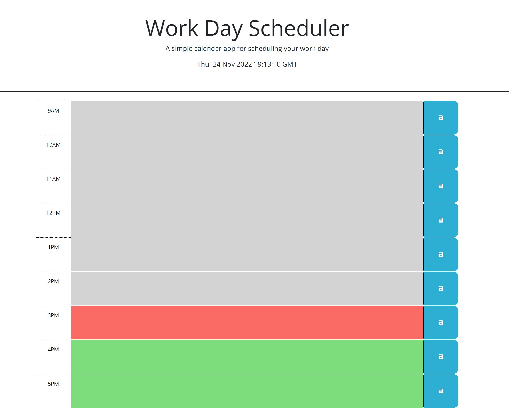

# My daily Scheduler

## Description

This is a scheduler site that allows you to set things in each time block so you can remember things like appointments. After you save something and refresh the pade the items will still show up.As well as the day progresses the past becomes grey the present is red and the future is green. 

## Installation

you can download the github repo here:

https://github.com/jarrettbutler/myDailyScheduler

You can also just visit the deployed site here:

https://jarrettbutler.github.io/myDailyScheduler/

and it should look like this

## Usage

Write down all appointments for the day right in the website the day before so that when you come back the next day you can see what there is to do and witch the time using coloured boxes so you'll never be late again!

## License

Please see repo for license

## Test

Please enter something in one of the textareas or all and when you reload the page it will all still be there

